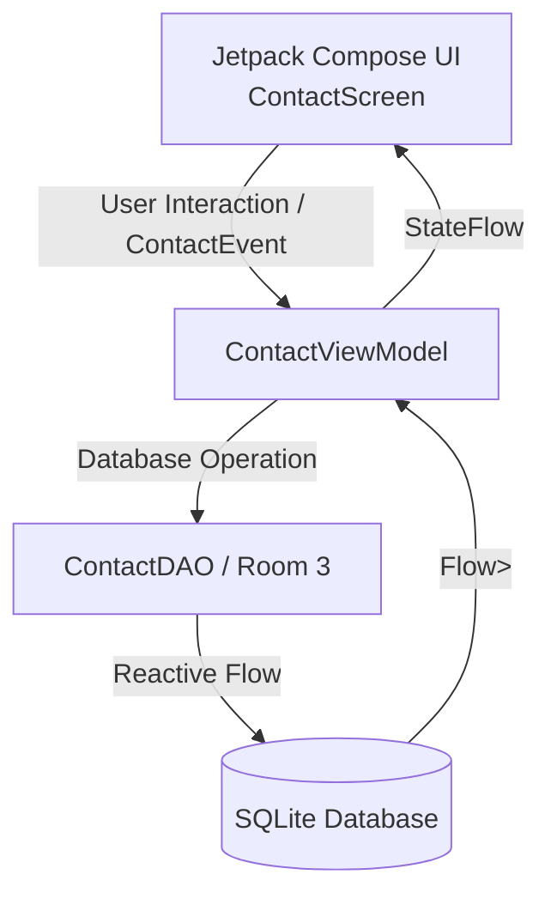

# 📱 Android Jetpack Compose & Room Database Showcase

[](https://kotlinlang.org/)
[](https://developer.android.com/jetpack/compose)
[](https://developer.android.com/training/data-storage/room)
[-orange.svg?style=for-the-badge)]()
[](LICENSE)

A modern, production-grade Android application showcasing **Room Database (Room 3.x)**, **Jetpack Compose (Material 3)**, and a clean **Unidirectional Data Flow (MVI/MVVM)** architecture.

---

## 📑 Table of Contents
- [✨ Key Features](#-key-features)
- [🏗️ Architectural Overview (MVI / UDF)](#️-architectural-overview-mvi--udf)
- [📁 Project Structure](#-project-structure)
- [🛠️ Tech Stack & Libraries](#️-tech-stack--libraries)
- [💡 How the Pipeline Works](#-how-the-pipeline-works)
- [🚀 Getting Started](#-getting-started)
- [🤝 Contributing & Author](#-contributing--author)

---

## ✨ Key Features

- **🗄️ Robust Offline-First Database**: Built with AndroidX Room 3 (`androidx.room3`) utilizing Kotlin Symbol Processing (KSP) and Kotlin Coroutines/Flow for fully reactive database queries.
- **🎨 Modern Material 3 UI**: Clean, responsive Jetpack Compose interface with dynamic color-matching, custom shape grouping for list items, and smooth animations.
- **🔍 Full-Screen Interactive Search**: Expandable search bar that seamlessly occupies the full viewport during queries and automatically hides the Floating Action Button (FAB).
- **🔀 Flexible Multi-Criteria Sorting**: 
  - Sort by **First Name** (A-Z)
  - Sort by **Last Name** (A-Z)
  - Sort by **Phone Number**
  - Sort by **Date Added** (Newest first)
- **⭐ Favorites System**: Quickly star and unstar important contacts with one-tap database persistence.
- **➕ Contact Management Dialog**: Add contacts with rich information including First Name, Last Name, Phone Number, Email, and Company.
- **🗑️ Swipe & Tap Deletion**: Delete contacts with immediate reactive state updates.

---

## 🏗️ Architectural Overview (MVI / UDF)

The application follows the **Unidirectional Data Flow (UDF)** pattern combined with **MVVM**:



### The Three Pillars

1. **State (`ContactState`)**:
   - Represents the complete, single source of truth for the UI at any point in time.
   - Immutable data class containing the contact list, form fields, search state, dialog visibility, and current sort preference.
2. **Events (`ContactEvent`)**:
   - Sealed interface defining every action a user can perform (e.g., `SaveContact`, `DeleteContact`, `SortContacts`, `SearchQueryChanged`, `ToggleFavorite`).
   - The UI never mutates state directly; it only emits events.
3. **ViewModel (`ContactViewModel`)**:
   - Handles business logic, reacts to incoming `ContactEvent` intents, queries the Room DAO, and combines reactive database flows into a single `StateFlow<ContactState>`.

---

## 📁 Project Structure

```
MyApplication/
├── roomdatabase/                           # Core Room Database & Compose module
│   ├── src/main/java/com/example/roomdatabase/
│   │   ├── RoomMainActivity.kt            # Entry-point Activity & ViewModel injection
│   │   ├── data/                          # Data & State Layer
│   │   │   ├── Contact.kt                 # Room Entity (@Entity)
│   │   │   ├── ContactDAO.kt              # Room 3 DAO (@Dao)
│   │   │   ├── ContactDatabase.kt         # Room 3 Database definition
│   │   │   ├── ContactEvent.kt            # User intent events (MVI)
│   │   │   ├── ContactState.kt            # Immutable UI state
│   │   │   ├── ContactViewModel.kt        # Reactive StateFlow manager
│   │   │   └── SortType.kt                # Sort criteria enum
│   │   ├── presentation/                  # UI Layer (Jetpack Compose)
│   │   │   └── ContactScreen.kt           # Screen, search, dialogs, cards & chips
│   │   └── ui/theme/                      # Theme, typography & color definitions
├── app/                                   # Application base module
├── bookkeeper/                            # Bookkeeper module
├── gradle/                                # Gradle wrapper & version catalogs
└── build.gradle.kts                       # Root build configuration
```

---

## 🛠️ Tech Stack & Libraries

| Technology | Purpose |
| :--- | :--- |
| **Kotlin** | Primary language with Coroutines & StateFlow |
| **Jetpack Compose** | Modern declarative UI toolkit |
| **Material 3** | Latest Material Design components and theming |
| **AndroidX Room 3.0.3** | SQLite abstraction layer with KSP code generation |
| **Kotlin Symbol Processing (KSP)** | High-performance annotation processor for Room |
| **AndroidX Lifecycle & ViewModel** | Architecture components managing UI-related data |

---

## 💡 How the Pipeline Works

Here is a simple real-life analogy for the MVI/MVVM pipeline:

> **Analogy: The Restaurant Kitchen**
> - **The Customer (UI / `ContactScreen`)**: Looks at the menu (**State**). When hungry, they place an order (**Event**), e.g., "Add cheese" or "Sort by price".
> - **The Waiter (ViewModel / `ContactViewModel`)**: Receives the order (**Event**), checks what needs to be done, and sends the request to the kitchen pantry.
> - **The Pantry & Chef (Room Database & DAO)**: Prepares the ingredients and updates the storage.
> - **The Serving Bell (Kotlin StateFlow)**: Whenever fresh food is ready, the waiter rings the bell and hands the updated dish (**New State**) to the customer. The customer never touches the kitchen directly!

---

## 🚀 Getting Started

### Prerequisites
- **Android Studio Ladybug | 2024.2.1** or newer
- **JDK 17** or **JDK 21** (bundled JBR recommended)
- **Android SDK Platform 35**

### Clone & Build
```bash
# Clone the repository
git clone https://github.com/Inheritance-Michael/My-public-app-list.git

# Navigate to the project root
cd My-public-app-list

# Build the Room Database module
./gradlew :roomdatabase:assembleDebug
```

---

## 🤝 Contributing & Author

Developed by **[Inheritance-Michael](https://github.com/Inheritance-Michael)**.  
Contributions, feedback, and star ratings are welcome!
